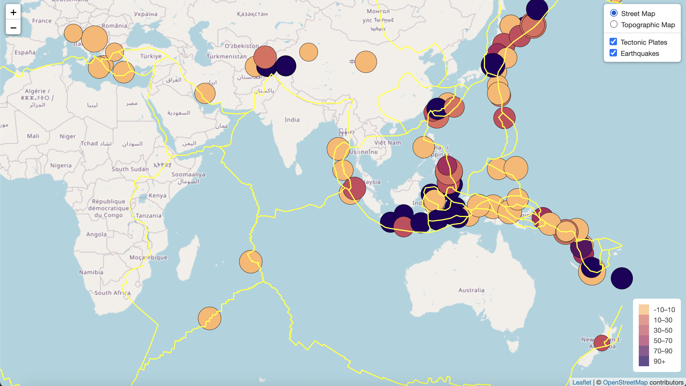

# leaflet-challenge

The United States Geological Survey, or USGS for short, is responsible for providing scientific data about natural hazards, the health of our ecosystems and environment, and the impacts of climate and land-use change. Their scientists develop new methods and tools to supply timely, relevant, and useful information about the Earth and its processes.

The USGS is interested in building a new set of tools that will allow them to visualise their earthquake data. They collect a massive amount of data from all over the world each day, but they lack a meaningful way of displaying it. In this challenge, you have been tasked with developing a way to visualise USGS data that will allow them to better educate the public and other government organisations (and hopefully secure more funding) on issues facing our planet.

1.) Follow these steps:

a.) The USGS provides earthquake data in a number of different formats, updated every 5 minutes. Visit the USGS GeoJSON FeedLinks to an external site. page and choose a dataset to visualise. 

b.) When you click a dataset (such as "All Earthquakes from the Past 7 Days"), you will be given a JSON representation of that data. Use the URL of this JSON to pull in the data for the visualisation. 

2.) Import and visualise the data by doing the following:

Using Leaflet, create a map that plots all the earthquakes from your dataset based on their longitude and latitude.

a.) our data markers should reflect the magnitude of the earthquake by their size and the depth of the earthquake by colour. Earthquakes with higher magnitudes should appear larger, and earthquakes with greater depth should appear darker in colour.

Hint: The depth of the earth can be found as the third coordinate for each earthquake.

b.) Include popups that provide additional information about the earthquake when its associated marker is clicked.

c.) Create a legend that will provide context for your map data.

d.)Your visualisation should look something like the preceding map.

References
Dataset created by the United States Geological Survey